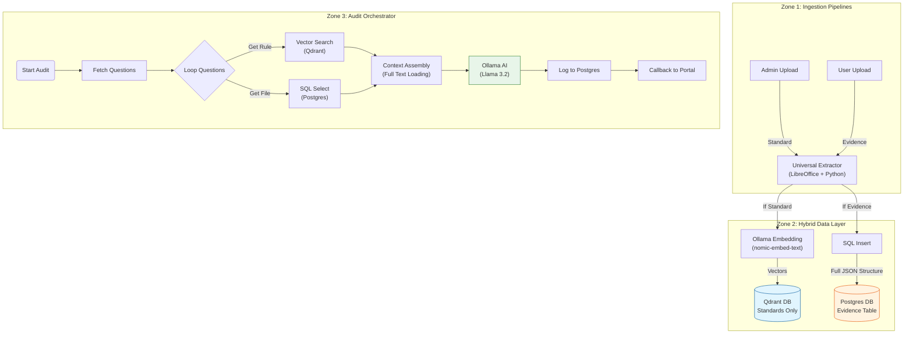

Compliance Audit System: Technical Specification
Version: 5.0 (Full Context Edition) Status: Approved for Implementation Infrastructure: Azure Standard D4s v5 (Local CPU)

1. The Visual Flow (Mermaid Blueprints)
A. System Architecture Diagram
Copy this into Mermaid Live Editor to visualize.

2. Infrastructure & Environment
Host: Azure Virtual Machine (Ubuntu 22.04) Spec: Standard_D4s_v5 (4 vCPU, 16GB RAM) Container Strategy: Monolithic Docker Compose (Shared Network & Volumes).

docker-compose.yml Structure
YAML
services:
  n8n:
    image: n8nio/n8n:latest
    environment:
      - DB_TYPE=postgresdb
      - DB_POSTGRESDB_HOST=postgres
      - QDRANT_HOST=qdrant
      - N8N_DEFAULT_BINARY_DATA_MODE=filesystem
    volumes:
      - ./shared_tmp:/tmp/n8n_processing # For file exchange with Florence
  
  # The "Brain" (Logic)
  ollama:
    image: ollama/ollama:latest
    entrypoint: ["/bin/sh", "-c", "/bin/ollama serve & sleep 5; /bin/ollama pull llama3.2; /bin/ollama pull nomic-embed-text; wait"]
    volumes:
      - ollama_data:/root/.ollama

  # The "Memory" (Standards)
  qdrant:
    image: qdrant/qdrant
    volumes:
      - qdrant_storage:/qdrant/storage

  # The "Filing Cabinet" (Evidence & Logs)
  postgres:
    image: postgres:16
    volumes:
      - postgres_data:/var/lib/postgresql/data
    environment:
      - POSTGRES_DB=compliance_db
      - POSTGRES_USER=n8n
      - POSTGRES_PASSWORD=secure_password

  # The "Eyes" (Vision Sidecar)
  florence:
    build: ./florence-service
    volumes:
      - ./shared_tmp:/tmp/n8n_processing
3. Database Schema (Postgres)
We utilize JSONB for the evidence table. This allows us to store not just the raw text, but also metadata (like page numbers, image captions) in a structured format that we can query or pass selectively to the AI.

SQL
-- 1. Evidence Storage (Full Context)
CREATE TABLE audit_evidence (
    id SERIAL PRIMARY KEY,
    session_id UUID NOT NULL,       -- The Audit Run ID
    q_id VARCHAR(50) NOT NULL,      -- Specific Question (e.g., "privacy_q1")
    filename VARCHAR(255),
    file_hash VARCHAR(64),          -- SHA256 for deduping
    
    -- The Core Content: Use JSONB for flexibility
    -- Structure: { "full_text": "...", "pages": [{ "page": 1, "text": "..." }], "images": [...] }
    extracted_data JSONB,           
    
    created_at TIMESTAMP DEFAULT NOW()
);
CREATE INDEX idx_evidence_lookup ON audit_evidence(session_id, q_id);
CREATE INDEX idx_evidence_hash ON audit_evidence(file_hash);

-- 2. Audit Logs (The "Flight Recorder")
CREATE TABLE audit_progress_logs (
    id SERIAL PRIMARY KEY,
    session_id UUID NOT NULL,
    step_name VARCHAR(100),         -- e.g., "fetching_evidence", "ai_reasoning"
    message TEXT,                   -- "Found 2 files for Q1"
    percentage INT,
    created_at TIMESTAMP DEFAULT NOW()
);

-- 3. File Registry (Deduping across system)
CREATE TABLE file_registry (
    file_hash VARCHAR(64) PRIMARY KEY,
    original_filename VARCHAR(255),
    processed_at TIMESTAMP DEFAULT NOW()
);
4. Workflow Specifications
Workflow A: "The Universal Extractor" (Utility)
This is your reusable micro-service.

Input: Binary File.

Hash Check: Calculate SHA-256. Return immediately if hash exists in file_registry (optional optimization).

Route:

Excel/CSV: Run libreoffice --headless --convert-to pdf.

Word/PPT: Run libreoffice --headless --convert-to pdf.

PDF: Pass through.

Process:

Run pdfplumber (Python) to extract text & tables.

If images exist → Send to Florence-2 for captioning.

Output: JSON Object:

JSON
{
  "file_hash": "abc...",
  "extracted_data": {
     "full_text": "ALL TEXT COMBINED...",
     "pages": [ ... ],
     "images": [ ... ]
  }
}
Workflow B: "Ingestion" (The Splitter)
The entry point for all files.

Webhook: POST /ingest (File, DocType, Domain, Q_ID, SessionID).

Call Workflow A (Get Extracted Data).

Switch (DocType):

PATH 1 (Standard):

Chunk Text (500 chars).

Embed via Ollama (nomic-embed-text).

Upsert to Qdrant (compliance_standards).

PATH 2 (Evidence):

NO EMBEDDING.

INSERT INTO Postgres (audit_evidence):

session_id, q_id, extracted_data (The full JSONB object).

Note: JSONB allows storing massive text efficiently.

Workflow C: "The Audit" (The Logic)
Webhook: POST /start-audit (SessionID).

Loop Questions:

Step 1: Semantic Search (Rule): Query Qdrant for the Standard.

Step 2: SQL Search (Evidence):

SELECT extracted_data->>'full_text' as text FROM audit_evidence WHERE session_id=$input.session_id AND q_id=$current.q_id.

Step 3: Logic Check:

If SQL returns NULL: Skip AI. Mark "Missing Evidence".

If Data exists: Call Ollama (llama3.2).

Prompt Strategy: Load the full text. If it exceeds Llama's context window (unlikely for <300 pages), use a recursive summarization loop (Chunk -> Summarize -> Final Answer). For POC, assume standard context fit.

Prompt: "Here is the Rule: {Qdrant}. Here is the Evidence Text: {Postgres}. Is it compliant?"

Step 4: Persistence: Write Log to Postgres → Send Callback to Portal.

Cleanup: DELETE FROM audit_evidence WHERE session_id=$input.session_id.

5. Edge Cases & Mitigations
Scenario	Mitigation
Massive Evidence (>50MB Text)	PostgreSQL JSONB handles ~255MB per field. Llama 3.2 has 128k context. If text > 128k tokens, Workflow C must implement a "Map-Reduce" loop (Split text -> Ask Question per chunk -> Aggregate answers).
Excel Templates	LibreOffice converts the visual layout to PDF first; OCR reads it as a structured document.
Duplicate Uploads	User uploads same file twice. SHA-256 Check: Workflow B detects the hash and returns "Success" immediately without re-processing.
Portal Disconnects	n8n writes to audit_progress_logs first. Portal can poll this table to resume the progress bar.
Empty Evidence	Workflow C checks SQL result count. If 0, it short-circuits to "Fail" without wasting AI tokens.
6. Implementation Checklist
Phase 1: Infrastructure

[ ] Deploy Azure VM & Docker Compose.

[ ] Initialize Postgres DB with schema v5.0 (JSONB tables).

Phase 2: Ingestion

[ ] Implement Workflow A with LibreOffice + Florence + Hash calculation.

[ ] Implement Workflow B (Ingestion) pointing to Postgres JSONB.

Phase 3: The Audit

[ ] Implement Workflow C (Audit) using direct SQL SELECT.

[ ] Verify Llama 3.2 Context window settings in Ollama (num_ctx parameter set to at least 32k or higher if RAM allows).
